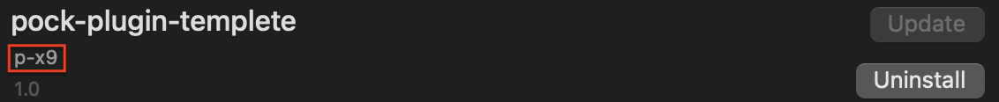

[](https://github.com/p-x9/pock-plugin-templete/issues)
[](https://github.com/p-x9/pock-plugin-templete/network/members)
[](https://github.com/p-x9/pock-plugin-templete/stargazers)
[](https://github.com/p-x9/pock-plugin-templete/)
# Pock Plugin Templete

## Usage
1. `pod install` and open `xxx.xcworkspace` file.
2. rename `SampleWidget` class to whatever you want. 
   If you have renamed it, you will also need to change the NSPrincipalClass part of the info.plist.
3. Create the view you want to display.
   (touch bar's height is 30point)
4. Assign the instance of the view you want to display to the view property of the Widget class.
   
## Optional
### Author name
Set the developer's name to `PKWidgetAuthor` in `Info.plist`.


### Mouse Control
Conform the widget class to the `PKScreenEdgeMouseDelegate` protocol.
```swift
/// Mouse entered at location in the touch bar.
func screenEdgeController(_ controller: PKScreenEdgeController, mouseEnteredAtLocation location: NSPoint, in view: NSView)

/// Mouse did move at location in the touch bar.
func screenEdgeController(_ controller: PKScreenEdgeController, mouseMovedAtLocation location: NSPoint, in view: NSView)

///Mouse clicked at location in the touch bar.
func screenEdgeController(_ controller: PKScreenEdgeController, mouseClickAtLocation location: NSPoint, in view: NSView)

//Mouse exited the touch bar at location.
func screenEdgeController(_ controller: PKScreenEdgeController, mouseExitedAtLocation location: NSPoint, in view: NSView)
```

## Preference View
Set the preference viewController class's name to `PKWidgetPreferenceClas`s in `Info.plist`.
ViewController class must confirm to `PKWidgetPreference`.